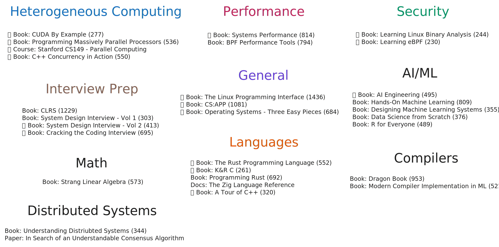
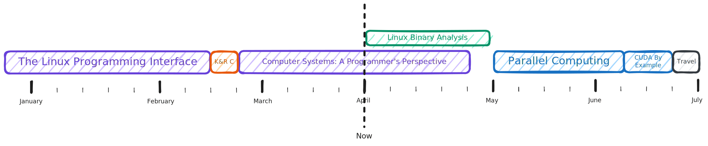
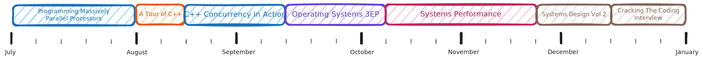

# Learn Log

This repo tracks my learning.

## Objectives

<picture>
  <source media="(prefers-color-scheme: dark)" srcset="./images/2026-objectives-dark.svg">
  
</picture>

## 2026 Schedule

<picture>
  <source media="(prefers-color-scheme: dark)" srcset="./images/2026-schedule-1-dark.svg">
  
</picture>
<picture>
  <source media="(prefers-color-scheme: dark)" srcset="./images/2026-schedule-2-dark.svg">
  
</picture>

## Production

> What I cannot create, I do not understand

- 📦 [Projects](./tx/projects.md)
- ✍️ [Blog Posts](./tx/blogs.md)
- 📹 [Videos](./tx/videos.md)
- 🎓 [Courses](./tx/courses.md)

## Consumption

- 📚 [Books](./rx/books.md)
- 🎓 [Courses](./rx/courses.md)
- 📄 [Documents](./rx/docs.md)
- 📑 [Papers](./rx/papers.md)
- ✍️ [Blog Posts](./rx/blogs.md)
- 🎤 [Talks](./rx/talks.md)
- 🧩 [Problem Sets](./rx/problems.md)

## Tools

- 🤔 [Ignorance List](./oob/ignorance.md)
